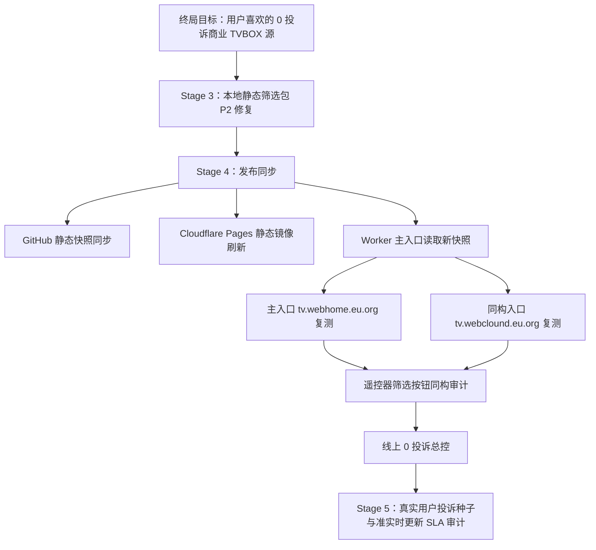

# TVBox v7.4 Stage 4 承接计划：发布同步与线上同构复测

## 1. 终局锚点

终局不变：

```text
用户喜欢的、0 投诉的、可商业化收费的顶级 TVBOX/FongMi/影视仓 点播 + 直播源。
```

本阶段不是追求“本地脚本通过”，而是把 Stage 3 已修复的静态 `filter-pack` 缺口同步到真实用户入口，避免用户在电视端选择筛选按钮时遇到空壳、卡顿或动态兜底失败。

## 2. 上一阶段已完成的承接证据

Stage 3 聚焦 P2：

```text
可见筛选按钮线上动态有数据，但本地静态 filter-pack 缺失。
```

已完成：

- `scripts/generate-snapshot.mjs` 新增有限动态筛选回填。
- 回填只在 `catalog-derived` 与 `search-backfill` 都为空时触发。
- 回填范围只覆盖当前可见筛选 job，不做全网暴力抓取。
- 本地重建后 `SNAPSHOT_PACK_GAP` 已降为 0。

当前证据：

```text
npm run triage:snapshot-warnings
total=20
current_tv_blocking=0
by_type=UI_HIDE_CANDIDATE=20

npm run audit:snapshot-pack-gaps
checked=0
visible_p2=0

npm run audit:zero-complaint
P0/P1/P2/P3=0/0/0/1
user_love_score=99

npm run check
22/22 PASS

npm run validate:online
pass=true
```

## 3. 当前残余差距

线上主入口仍显示旧更新时间码：

```text
https://tv.webhome.eu.org/config.json
影视点播 · 219180706202
```

本地新快照已显示：

```text
dist/config.json
影视点播 · 510280706202
```

这说明：

- 本地修复已经形成新快照。
- 线上入口尚未消费本地新快照。
- 下一阶段重点不是继续修 filter-pack，而是发布同步、镜像一致性和线上同构复测。

## 4. 全局执行路线



## 5. 局部任务拆解

### 5.1 发布前冻结

- 固定本地工作树中本阶段相关源码与快照。
- 确认 `scripts/generate-snapshot.mjs` 是唯一代码修复点。
- 确认 `dist/snapshot/latest/validation.json` 无 errors。
- 确认 `audit/snapshot-pack-gap-latest.json` 中 `checked=0`。

### 5.2 GitHub 同步

- 检查 Git remote。
- 若认证可用，推送：
  - `scripts/generate-snapshot.mjs`
  - `dist/config.json`
  - `dist/status.json`
  - `dist/snapshot/latest/**`
  - `audit/*latest.json`
  - `audit/*summary.md`
  - `docs/next-stage-execution-plan-2026-07-08-stage4.md`
- 若认证不可用，记录阻断，不伪造“已上线”。

### 5.3 Cloudflare Pages / Worker 刷新

- 等待 Pages 读取 GitHub 最新 `dist`。
- 检查：
  - `/config.json`
  - `/status.json`
  - `/snapshot.json`
  - `/agg?ac=videolist&t=1&pg=1&limit=8`
  - `/agg?ac=videolist&t=0&pg=1&limit=24&f={"year":"2023"}`
- 验证线上 `visibleUpdateText` 与本地新快照一致或更新。

### 5.4 主备入口同构复测

主入口：

```text
https://tv.webhome.eu.org
```

同构入口：

```text
https://tv.webclound.eu.org
```

必须分别验证：

- config 200。
- siteName 只有 `影视点播 · 数字码`。
- 10 个点播主分类非空。
- 可见筛选按钮不依赖缺失静态包。
- 搜索、详情、播放抽样仍可用。
- 不出现“备用”字样。

## 6. 节点级验收

Stage 4 只有同时满足以下条件，才能进入 Stage 5：

```text
线上 config 更新时间码已刷新。
主入口 validate:online pass=true。
同构入口 validate:online pass=true。
线上筛选包缺口 audit:snapshot-pack-gaps visible_p2=0。
zero_complaint_gate 不出现 P0/P1/P2。
所有验证命令有新鲜输出。
```

## 7. 末梢检查清单

- 年份筛选：
  - 推荐 / 2023
  - 推荐 / 2025
  - 推荐 / 2010年代
  - 电影 / 2025
  - 剧集 / 2010年代
  - 纪录片 / 2010年代
- 每个请求检查：
  - HTTP 200。
  - `list.length > 0`。
  - `snapshot_mode=filter-pack` 或有明确动态兜底证据。
  - 不重复。
  - 内容语义与按钮一致。
  - 详情页能打开。
  - 播放线路非广告、非 iframe、非解析页。

## 8. 反向核对

- 如果线上未刷新：不是用户源质量问题，而是发布链路问题。
- 如果线上刷新但按钮仍空：回到 Worker 快照路由与 Pages 文件读取。
- 如果线上按钮有数据但语义不对：回到筛选语义与源标签解析。
- 如果线上按钮有数据但播放失败：回到详情与播放线路过滤。
- 如果所有技术检查都通过：进入真实用户投诉种子、准实时更新 SLA、商业并发与免费额度持续审计。

## 9. 下一阶段承接

Stage 5 不再以单个 P2 修复为中心，而是围绕终局图推进：

```text
真实用户体验闭环 + 准实时更新 SLA + 免费商业承载边界 + 主备入口持续一致性。
```

重点从“本地快照正确”升级为“线上用户随时访问都正确”。
