# TVBox v7.4 用户喜欢的 0 投诉商业源终局全局全景流程图

## 不可变终局锚点

```text
终局目标 = 用户喜欢的 0 投诉商业 TVBOX 源
业务形态 = 可公开订阅、可收费运营、点播 + 直播一体化
体验标准 = 不只是能返回，而是好找、好选、好播、更新及时、无重复、无广告、无空壳、无困惑
工程标准 = 免费优先承载、实时/准实时更新、全链路审计、根因闭环、可回滚、可持续维护
阶段原则 = 每一阶段都必须从终局反推，不允许只围绕接口通过、脚本通过、源数量增加或局部修 Bug 结束
当前双版本原则 = 同一套源发现、准入、快照、审计、发布链路必须同时产出“全量版”和“洁净版”；全量版保留成人内容，洁净版去掉成人内容；两者必须同时间更新发布、同时间验证
当前更新原则 = 免费优先条件下，热刷新目标从小时级收敛到 30 分钟级；电视端显示的倒序更新时间必须来自验证通过的快照，不展示失败刷新时间
```

## 防跑偏校验

任何规划、执行、审计、部署、修复、总结，都必须先回答 6 个问题：

1. 这一步是否让普通电视用户更喜欢用？
2. 这一步是否减少一个真实投诉点？
3. 这一步是否提升点播或直播的可发现、可播放、可更新能力？
4. 这一步是否避免重复、空壳、错分、广告、缓存不一致、更新滞后？
5. 这一步是否仍然符合免费优先承载与可商业化运营边界？
6. 这一步是否能被遥控器全链路、覆盖率、源准入、免费层、快照与主备入口审计复核？

## 终局全景流程图

```mermaid
flowchart TD
  A["终局目标<br/>用户喜欢的 0 投诉商业 TVBOX 源<br/>顶级实时更新点播+直播<br/>可收费可公开订阅<br/>自运营全免费"] --> A1["用户价值层<br/>愿意长期使用<br/>愿意付费订阅<br/>愿意推荐他人<br/>没有有效投诉"]

  A1 --> B["用户入口层<br/>固定主入口 config.json<br/>影视点播单入口<br/>直播入口清晰可用<br/>更新时间直观但不噪音"]

  B --> B2["双版本入口层<br/>全量版 config.json<br/>洁净版 config-clean.json<br/>全量版 /agg<br/>洁净版 /agg-clean<br/>两套入口同源生成<br/>同时间更新发布"]

  B2 --> C["体验验收层<br/>分类非空<br/>筛选有语义<br/>搜索精准<br/>详情可打开<br/>播放线路有效<br/>无重复无广告<br/>洁净版无成人暴露"]

  C --> D["更新服务层<br/>免费热刷新目标 30 分钟级<br/>全量刷新 2 小时级<br/>旧快照回滚<br/>动态兜底<br/>失败刷新不更新可见时间"]

  D --> E["源宇宙发现层<br/>公开可发现源<br/>TVBox/FongMi可接入源<br/>直播源发现<br/>点播源发现<br/>候选源注册表"]

  E --> F["源准入审计层<br/>分类可读<br/>搜索可用<br/>详情可用<br/>播放直连有效<br/>过滤广告/解析页/公告"]

  F --> G["内容标准化层<br/>统一内容模型<br/>canonical identity<br/>别名/主演/年份/标签<br/>直播点播分流 ingest"]

  G --> H["聚合索引层<br/>分类索引<br/>筛选索引<br/>搜索索引<br/>热更新索引<br/>直播频道索引"]

  H --> I["去重排序层<br/>跨源去重<br/>跨分类去重<br/>跨筛选去重<br/>跨搜索去重<br/>播放有效优先"]

  I --> J["发布承载层<br/>Worker 内存缓存<br/>KV 热指针<br/>GitHub raw 快照<br/>Cloudflare Pages 快照<br/>自有域名镜像"]

  J --> K["电视端请求层<br/>TVBox<br/>FongMi<br/>影视仓<br/>请求变体兼容<br/>缓存重进一致"]

  K --> L["遥控器全链路审计<br/>L0配置<br/>L1入口<br/>L2分类<br/>L3列表<br/>L4筛选组<br/>L5筛选项<br/>L6组合筛选<br/>L7分页<br/>L8搜索<br/>L9详情<br/>L10播放<br/>L11重进<br/>L12运维"]

  L --> M["0投诉商业体验总控门禁<br/>聚合遥控器审计<br/>覆盖率审计<br/>源准入审计<br/>免费层审计<br/>快照验证<br/>主备入口探测"]

  M --> M1{"是否达到用户喜欢的0投诉商业体验"}
  M1 -- "是" --> N["运营闭环<br/>公开订阅<br/>状态监控<br/>免费额度审计<br/>故障回滚<br/>用户反馈进入审计种子<br/>投诉归零复盘<br/>满意度持续复测"]
  M1 -- "否" --> O["投诉根因归类<br/>P0不可导入/全站不可用<br/>P1核心搜索/播放/详情/分类失败<br/>P2重复/排序/标签/更新/筛选不足<br/>P3文案/展示/体验优化<br/>SOURCE_UNIVERSE_GAP<br/>TAG_PARSE_GAP<br/>FILTER_LOGIC_BUG<br/>SNAPSHOT_MISS<br/>PLAYBACK_FAIL<br/>CACHE_STALE<br/>APP_REQUEST_VARIANT"]
  O --> P["修复策略<br/>扩源<br/>补解析<br/>修筛选<br/>补热索引<br/>修去重<br/>调排序<br/>隐藏不可证按钮"]
  P --> D
  N --> D
```



## 分阶段推进框架

1. **终局层**：用户喜欢的 0 投诉商业 TVBOX 源；顶级实时更新点播 + 直播；可收费、可公开订阅、自运营全免费。
2. **全局层**：用户价值、直播、点播、搜索、更新、审计、稳定性、商业化、运营闭环统一设计。
3. **局部层**：源发现、源准入、canonical、热索引、快照、Worker、电视端兼容分别建设。
4. **节点层**：每个接口、分类、筛选项、搜索词、播放线路都有可验证证据。
5. **末梢层**：每个遥控器按钮选择后，返回格式、数量、语义、分页、详情、播放都正确。
6. **总控门禁**：任何阶段交付都必须进入 0 投诉商业体验总控门禁，统一检查遥控器、覆盖率、源准入、免费层、快照与入口状态。
7. **反向核对**：任何末梢问题都要回溯到节点、局部、全局、终局，不能头疼医头。

## 终局验收口径

- **用户喜欢**：不是只追求接口通，而是导入简单、入口清楚、内容丰富、搜索准确、播放稳定、更新及时、遥控器操作不困惑。
- **0 投诉**：任何用户可感知问题都不能被工程指标掩盖；有效投诉必须进入审计种子、根因归类、修复队列和复测闭环。
- **顶级**：电视端入口清晰、分类完整、搜索精准、筛选有语义、详情稳定、播放有效、响应快、无广告噪音。
- **实时更新**：热点内容接受小级别时间差，全量内容按免费额度可承载的最高频率持续同步；旧快照可回滚，用户端无感。
- **点播 + 直播**：点播和直播分流接入、统一审计、统一状态呈现，不互相污染。
- **可收费**：公开订阅时具备稳定性、并发承载、状态监控、故障回滚、用户反馈闭环和投诉归零机制。
- **满足用户期待**：用户按标题、别名、主演、年份、地区、类型、标签、分类、筛选搜索时，应返回符合语义的唯一结果集合。
- **无投诉**：任何空按钮、重复节目、错分内容、失效播放、缓存不一致、更新滞后，都必须进入根因审计和阶段修复队列。
- **自运营全免费**：不买主机、不买付费 CDN、不代理大规模视频流；通过 GitHub、Cloudflare 免费能力、静态快照、KV 热索引、缓存和降频策略达成。
- **商业总控门禁**：只有 P0=0、P1=0、遥控器 FAIL=0、重复率达标、详情/播放达标、免费层无硬失败、快照无 error，并且没有未解释的用户可感知投诉时，才允许判断为可商业化推广。

## 下一阶段规划模板

每个阶段完成后，必须按以下结构生成下一阶段计划：

```text
阶段名称：
上一阶段证据：
终局承接：
全局影响：
局部任务：
节点任务：
末梢验证：
风险与免费额度：
验收命令：
失败回退：
下一阶段入口：
```
